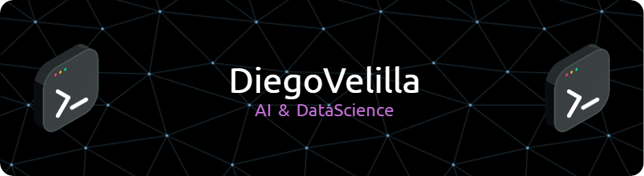

    

## 👋 About Me
Hi there! I'm Diego, a computer science student with a passion for AI. I'm experienced in Python and eager to keep learning about deep learning and NLP. My interests lie in creating innovative AI solutions that can solve real-world problems and improve people's lives. Whether it's building intelligent systems from scratch or fine-tuning existing models, I am always excited to explore new ideas and push the boundaries of what AI can achieve.

## 🔧 Skills
🐍 Python

🐼 Pandas

🔥 PyTorch

📊 Matplotlib

🗣️ NLP

## 🌟 Featured Projects
- [**FreeThinker**](https://github.com/diegovelilla/FreeThinker): No-cost-per-token AI agent built with Python and Llama 3.1 70B model.

- [**EssAI**](https://github.com/diegovelilla/EssAI): Fine-tuned LLM to detect AI-generated essays. Built with Python and Google's Bert base model.

- [**Stroke-o-Scope**](https://github.com/diegovelilla/Stroke-o-Scope): Deep neural network built from scratch using PyTorch to detect early signs of stroke predisposition.

## 🤝 Contact Me

